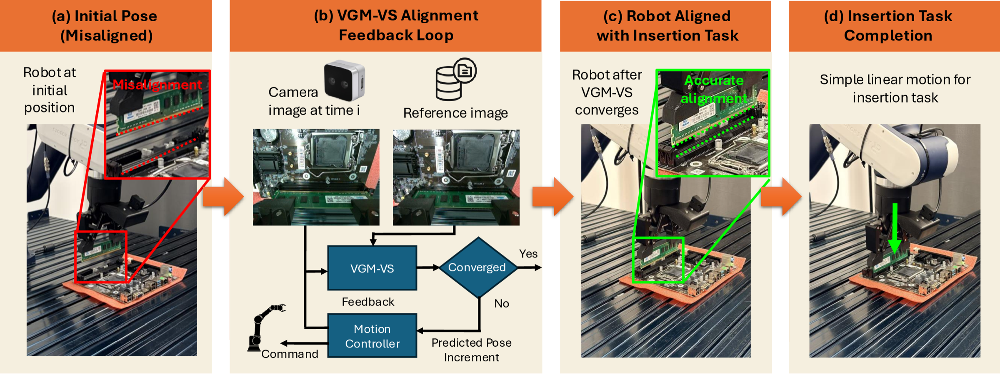

# VGM-VS: Rethinking Visual Geometry Model for High-Precision Visual Servoing

<div align="center">

### [Paper](static/pdf/vgm-vs.pdf) | [arXiv](https://arxiv.org/abs/2609.28312)

Yimin Pan<sup>1</sup>, Sen Wang<sup>1,2,*</sup>, You Zhou<sup>1</sup>, Jianfeng Gao<sup>1</sup>,  
Pengbo Sun<sup>1</sup>, Ahmed M. Naguib<sup>1</sup>, Zoltan-Csaba Marton<sup>1</sup>

<sup>1</sup>Agile Robots SE, <sup>2</sup>Technical University of Munich

<sup>*</sup>Corresponding author

</div>



## About

We present VGM-VS, a visual servoing method built on a pretrained feed-forward
visual geometry model. Given the current view and a reference image captured at
the target configuration, we estimate the relative camera pose with a visual
geometry model and apply it iteratively as the pose increment of a closed-loop
pose-based visual servoing (PBVS) scheme. The geometry-aware representation
acquired from large-scale pretraining keeps this estimate reliable when the
target is occluded, weakly textured, or covers only a small part of the image.

However, the scale ambiguity inherent to these models leaves the predicted
translation defined up to an unknown scale, while the pose increment must be
metric for robot control. We close this gap with a scene-specific metric
adaptation: the robot autonomously records image–pose pairs along a predefined
motion starting from the target pose, and we fine-tune the camera head on these
data, jointly learning the hand–eye transform and thus removing the need for a
dedicated calibration process.

We evaluate our method on three real-world assembly tasks with demanding
tolerances: USB-C cable picking, cable insertion, and RAM insertion. Running in
real time at 30 Hz, VGM-VS converges to submillimeter terminal accuracy on the
cable tasks and reaches success rates of 90–100% when the target is moved during
servoing. It converges in all trials under initial displacements of up to 30 cm
from the reference pose and with 50% of the target object occluded, outperforming
the compared visual servoing baselines.

## BibTeX

```bibtex
@misc{pan2026vgmvs,
  title={VGM-VS: Rethinking Visual Geometry Model for High-Precision Visual Servoing},
  author={Yimin Pan and Sen Wang and You Zhou and Jianfeng Gao and Pengbo Sun and Ahmed M. Naguib and Zoltan-Csaba Marton},
  year={2026},
  eprint={2609.28312},
  archivePrefix={arXiv},
  primaryClass={cs.RO},
  url={https://arxiv.org/abs/2609.28312},
}
```
